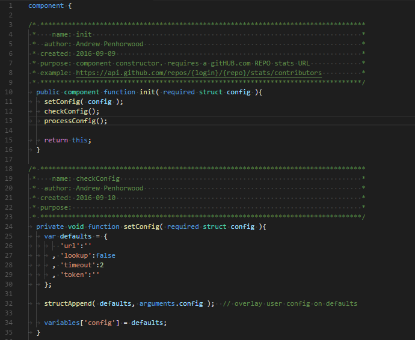
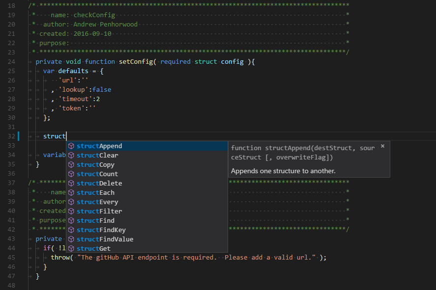
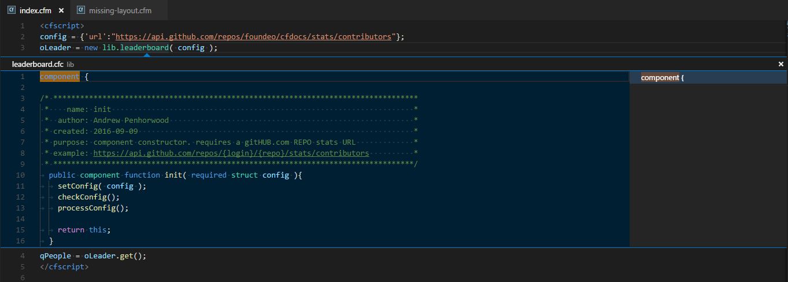

# VS Code CFML

An extension for Visual Studio Code to assist in development with CFML.

## Acknowledgements

- [`vscode-coldfusion`](https://github.com/ilich/vscode-coldfusion/) on which the syntax highlighting is based, which was based on the next extension
- [`sublimetext-cfml`](https://github.com/jcberquist/sublimetext-cfml) as inspiration for some of the features. "Parsing" logic (including regexes) was also used.
- [`cfdocs`](https://github.com/foundeo/cfdocs/) as the default documentation and sample images in this README
- [`vscode-php-docblocker`](https://github.com/neild3r/vscode-php-docblocker) as the basis for docblock completion

## Features

1. **Syntax Highlighting**  


1. **Signature Help**  
Automatically triggers within signature of a function or can be manually triggered. Currently limited to CFML global functions and internal/inherited component functions.  
Win/Linux: `Ctrl+Shift+Space`; Mac: `Cmd+Shift+Space`


1. **Hover Documentation**  
Displays documentation for functions and tags. Currently limited to CFML global functions and tags/attributes as well as internal/inherited component functions. Does not always consider context, so for example it may also trigger on SQL or JavaScript functions with the same name.  
Win/Linux: `Ctrl+K Ctrl+I`; Mac: `Cmd+K Cmd+I`


1. **Document Symbols**  
Search symbols within a document.  
Win/Linux: `Ctrl+Shift+O`; Mac: `Cmd+Shift+O`


1. **Workspace Symbols**  
Search symbols within the workspace. Limited to components and their function declarations.  
Win/Linux: `Ctrl+T`; Mac: `Cmd+T`


1. **Completion Suggestions**  
Suggestions for global functions and tags, tag attributes, user functions, keywords, scopes, component properties, variables, component dot-paths, and docblocks.  
Win/Linux: `Ctrl+Space`; Mac: `Cmd+Space`


1. **Definition**
Provides a link to the definition of a symbol. Currently only for object creation, function usage within the same or inherited component, function return types, argument types, property types, component extends, function arguments, function local variables, and application variables.  
_Go to Definition:_ Win/Linux: `F12`/`Ctrl+Click`; Mac: `F12`  
_Peek Definition:_ Win/Linux: `Alt+F12` (`Ctrl`+hover provides a smaller, alternate peek); Mac: `Opt+F12`


## Settings

The following are the configurable Settings (Win/Linux: `Ctrl+Comma`; Mac: `Cmd+Comma`) that this extension contributes to VS Code:

- `cfml.globalDefinitions.source`: The source of the global definitions. Currently only supports CFDocs. [*Default*: `cfdocs`]
- `cfml.cfDocs.source`: Indicates which source will be used for CFDocs.  
**Values**
  - `remote`: Retrieve resources remotely from GitHub. [*Default*]
  - `local`: Retrieve resources locally using `cfml.cfDocs.localPath`.
- `cfml.cfDocs.localPath`: [*Optional*] Absolute path to the data directory of CFDocs.
- `cfml.hover.enable`: Whether hover is enabled. [*Default*: `true`]
- `cfml.signature.enable`: Whether signature help is enabled. [*Default*: `true`]
- `cfml.suggest.enable`: Whether completion help is enabled. [*Default*: `true`]
- `cfml.suggest.snippets.enable`: Whether snippets are part of completion help. [*Default*: `true`]
- `cfml.suggest.snippets.exclude`: Set of snippet keys you would like excluded from suggestions. See [snippets.json](./snippets/snippets.json).
- `cfml.suggest.globalFunctions.enable`: Whether global functions are part of completion help. [*Default*: `true`]
- `cfml.indexComponents.enable`: Whether to index all components in workspace on startup. This is done on each startup and duration depends on number and complexity of components as well as hardware specifications. Editor may be unresponsive during this period. It is currently required for most features involving components. [*Default*: `true`]
- `cfml.autoCloseTags.enable`: Whether to enable auto-closing tags for CFML. This uses the third-party extension `auto-close-tag`. Changing this requires a restart. [*Default*: `true`]
- `cfml.autoCloseTags.configurationTarget`: Auto-configuration target for auto-closing tags. [*Default*: `Global`]
- `cfml.emmet.enable`: Whether to enable Emmet for CFML. Changing this requires a restart. [*Default*: `false`]
- `cfml.emmet.configurationTarget`: Auto-configuration target for Emmet. [*Default*: `Global`]
- `cfml.docBlock.gap`: Whether there should be a gap between the hint and other tags in a docblock. [*Default*: `true`]
- `cfml.docBlock.extra`: Extra tags you would like to include in every docblock  
  **Example**
    ```json
    "cfml.docBlock.extra": [
        {
            "name": "output",
            "default": "false",
            "types": [
                "component",
                "function"
            ]
        }
    ]
    ```
- `cfml.engine.name`: Name of the CFML engine against which to filter.
- `cfml.engine.version`: Version of the CFML engine against which to filter. SemVer format is preferred.

## Commands

Used in Command Palette (Win/Linux: `Ctrl+Shift+P`; Mac: `Cmd+Shift+P`). Can also be bound to Keyboard Shortcuts (Win/Linux: `Ctrl+K Ctrl+S`; Mac: `Cmd+K Cmd+S`).

- Refresh cache for global definitions
- Refresh cache for workspace definitions
- Toggle CFML line comments (`Ctrl+/`)
- Toggle CFML block comments (`Shift+Alt+A`)

## Known Issues/Limitations

1. Initial indexing can be a lengthy process depending on how many components you have and your hardware specifications. During this time, features will be unavailable and the editor will be sluggish.
1. There is no embedded language support, which means that you will not get HTML/CSS/JS/SQL assistance within CFML files. You will still get syntax highlighting and you can use user snippets and Emmet to supplement somewhat.
1. An extension of the issue above is that as implemented there is only one language defined for CFML. This can cause a number of issues where functionality or settings are based on language ID. For example, with Emmet enabled, you will get the Emmet functionality throughout the CFML files and contexts.
1. Removing, moving, or renaming folders does not update the workspace definitions or symbols and will cause discrepancies with those resources. To rectify this, you may use the command to refresh workspace definitions at any time.
1. Completion suggestions are not always properly contextual.
1. The "parsing" is mostly done with regular expressions without considering context in most cases, which can result in occasional issues. One way this manifests is that you may get non-CFML being parsed as CFML. This can also result in strings and comments being parsed as if they were part of code. To simplify the expressions, semicolons are often expected as terminators in CFScript even though they are optional in some engines.
1. Type inference is extremely primitive and only based on variable initialization.
1. Syntax highlighting breaks for embedded grammars (CSS and JavaScript) when only partially wrapped in `<cfoutput>`.

## Future Plans

Feel free to open issues for these or any other features you would find helpful so we can discuss.

- Signature help for external component functions
- Hover documentation for external component functions
- Provide additional completion suggestions
  - Global member functions
  - Enumerated values for global functions
- Definitions for more contexts
- Type Definitions for more contexts
- References
- Custom mapping
- Use proper parser ([CFParser](https://github.com/cfparser/cfparser))
- Utilize a CFML language server

## Recommended Extensions

VS Code and this extension lack features and functionality that I find useful for development. Below are some supplemental extensions that I believe will improve the development experience for most.

- [Auto Close Tag](https://marketplace.visualstudio.com/items?itemName=formulahendry.auto-close-tag) - Enables automatic closing of tags. There are settings (`cfml.autoCloseTags.*`) to automate the configuration for HTML and CFML tags.
- [CFLint](https://marketplace.visualstudio.com/items?itemName=KamasamaK.vscode-cflint) - Integrates CFLint into VS Code as diagnostics.
- [highlight-matching-tag](https://marketplace.visualstudio.com/items?itemName=vincaslt.highlight-matching-tag) - This seems to break often, but I've found it to work just enough to be useful.
- [Path Intellisense](https://marketplace.visualstudio.com/items?itemName=christian-kohler.path-intellisense) - Provides suggestions when entering file paths
- [Code Outline](https://marketplace.visualstudio.com/items?itemName=patrys.vscode-code-outline) - Displays document symbols in an outline view in the Explorer
- [TODO Highlight](https://marketplace.visualstudio.com/items?itemName=wayou.vscode-todo-highlight)

## Release Notes

See [CHANGELOG.md](/CHANGELOG.md)

## Contributing

See [CONTRIBUTING.md](/CONTRIBUTING.md)
